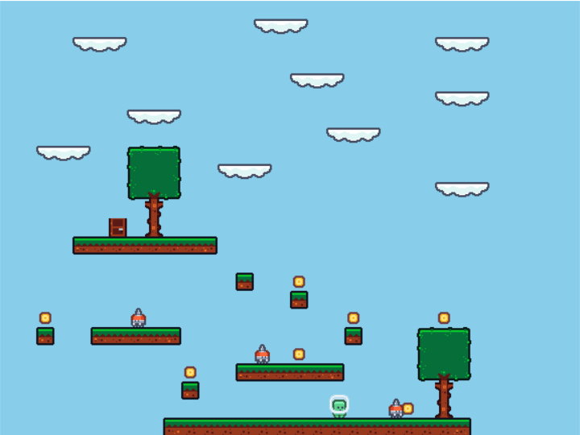

# game-like-mario

Шикунов Максим Евгеньевич P3333  
Вариант: 2d платформер (марио) + поведение ботов на freemonad

## Требования к разработанному ПО

Разработать 2d игру похожую на марио с помощью библиотеки Gloss.
Реализовать врагов, у которых поведение будет описано с помощью Free Monad

## Реализация программы

Два метода реализованы в файлу [Interpolation.hs](src/Interpolation.hs)  

Реализация программы разделена на несколько блоков:
- [Collision.hs](src/Collision.hs) (Обработка столкновений)
- [Player.hs](src/Player.hs) (Логика игрока)
- [Enemy.hs](src/Enemy.hs) (Логика бота)
- [Render.hs](src/Render.hs) (Отрисовка игры)
- [Update.hs](src/Update.hs) (Логика изменения состояний игры)
- [Util.hs](src/Util.hs) (Основные типа и структуры для игры)

### Функция отрисовки

```haskell
render :: GameState -> [Picture] -> Picture
render gs allPictures =
  pictures
    ( [drawTile cellToPrint allPictures | cellToPrint <- currentLevel gs, snd $ snd cellToPrint]
        ++ [uncurry translate (position gs) (allPictures !! playerImg gs)]
        ++ [uncurry translate (fst $ cell (fst enemy)) (fromMaybe blank (whatImg (cell (fst enemy)) allPictures)) | enemy <- enemies gs]
    )
```

### Функция обновления состояния игры

```haskell
updateState :: Float -> GameState -> GameState
updateState dt gs =
  if not $ restart gs
    then
      gs
        { position = newPosition,
          playerImg = updatePlayerImg (speedX gs) (playerImg gs) gs,
          animationTime = updateAnimationTime gs dt,
          speedY = newSpeedY,
          coinsGot = coinsGot gs + updateCoinsGot (currentLevel gs) newPosition,
          jumpDirection = updateJumpDirection (jumpDirection gs) maybeNewPointY gs,
          currentLevel = updateLevel (currentLevel gs) newPosition,
          enemies = map (uncurry (interpretEnemy gs)) (enemies gs),
          restart = isDie newPosition gs
        }
    else
      gs
        { currentLevel = resetLvl (currentLevel gs),
          position = startPosition,
          playerImg = startPlayerImg,
          animationTime = 0.00,
          moveDirection = Util.None,
          jumpDirection = Util.Stay,
          speedX = 0.00,
          speedY = 0.00,
          coinsGot = 0,
          allCoinsNumber = allCoinsLvl,
          restart = False,
          enemies =
            [ (Enemy {cell = ((40.0, -186.0), ('o', True)), direction = 1}, enemyBehaviorRight),
              (Enemy {cell = ((4.0, -132.0), ('p', True)), direction = 1}, enemyBehaviorLeft),
              (Enemy {cell = ((-150.0, -96.0), ('o', True)), direction = 1}, enemyBehaviorRight)
            ]
        }
  where
    maybeNewPointY = (fst $ position gs, snd (position gs) + speedY gs - 0.1)
    newPosition = moveY (speedY gs) gs $ moveX (moveDirection gs) gs
    newSpeedY = updateSpeedY (jumpDirection gs) maybeNewPointY gs
```

### Функция отловли действий игрока

```haskell
handleEvent :: Event -> GameState -> GameState
handleEvent (EventKey (Char 'a') Down _ _) gs =
  gs {moveDirection = Util.Left, speedX = updateSpeedX (speedX gs) (moveDirection gs == Util.Left)}
handleEvent (EventKey (Char 'd') Down _ _) gs =
  gs {moveDirection = Util.Right, speedX = updateSpeedX (speedX gs) (moveDirection gs == Util.Right)}
handleEvent (EventKey (Char 'w') Down _ _) gs = if jumpDirection gs == Util.Stay then gs {speedY = 3.5, jumpDirection = Util.Jump} else gs
handleEvent (EventKey (Char 'f') Down _ _) gs = if isCollision isHitX isDoorNeeded (position gs) gs && coinsGot gs == allCoinsNumber gs then gs {restart = True} else gs
handleEvent (EventKey (Char key) Up _ _) gs =
  if (moveDirection gs == Util.Right && key == 'd')
    || (moveDirection gs == Util.Left && key == 'a')
    then gs {moveDirection = Util.None, speedX = 0}
    else gs
handleEvent _ gs = gs {moveDirection = Util.None, speedX = 0}
```

### Запуск программы

```haskell
play
    window
    background
    60
    state
    ( `render`
        [ earthLeftImg,
          ... (все изображения)
          tree11Img
        ]
    )
    handleEvent
    updateState
```

## Работа программы


